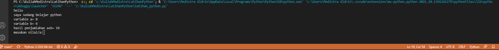

# LatihanPython
## Latihan python dan membuat program Biodata

### Nama : Medistra Aldrin
### NIM : 312110266

Pertama-tama buat script seperti pada gambar berikut ini : 

Kemudian klik opsi run, lalu input data diri anda

setelah selesai akan mengeluarkan hasil output sesuai data yang di input 

 dan hasilnya seperti gambar berikut<

## Membuat program penjumlahan dan pembagian

masukan scriipt  seeperti pada gambar berikut ini : 

kemudian klik opsi run, lalu input angka yang diinginkan

Contoh hasilnya seperti gambar berikut ini :

